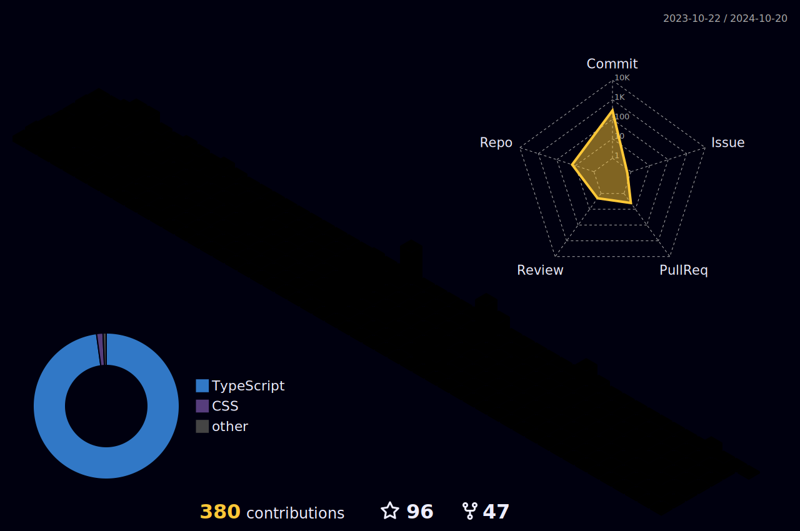

  

 

  

 

  
  

 

---

  <h3>
    
    Stack Tecnológico
  </h3>
  

 

---

  <h3>
    
    Estatísticas do GitHub
  </h3>
  
  
  

 

  

 

  

 

---

  <h3>
    
    Conquistas
  </h3>
  

 

---

  <h3>
    
    Conecte-se
  </h3>
  
  
  
  

 

  

 

  

